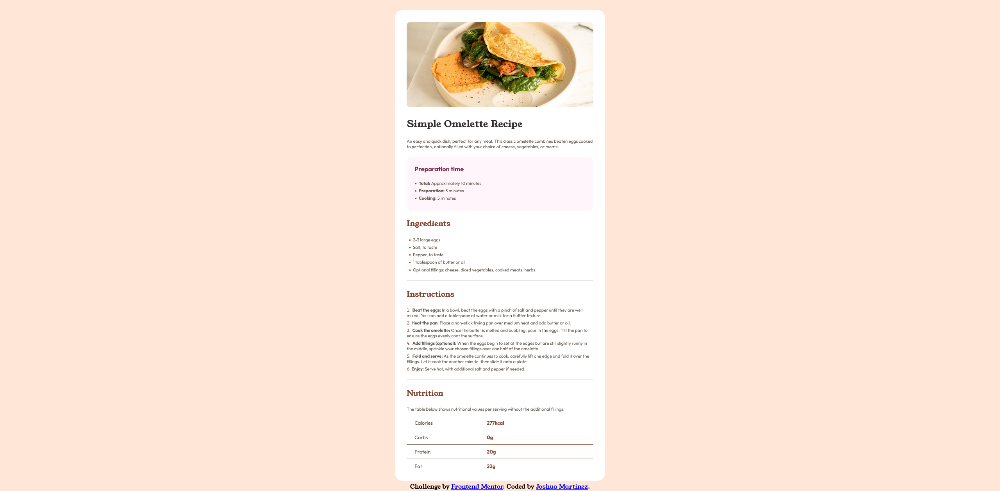

# Frontend Mentor - Recipe page solution

This is a solution to the [Recipe page challenge on Frontend Mentor](https://www.frontendmentor.io/challenges/recipe-page-KiTsR8QQKm). Frontend Mentor challenges help you improve your coding skills by building realistic projects. 

## Table of contents

- [Overview](#overview)
  - [The challenge](#the-challenge)
  - [Screenshot](#screenshot)
  - [Links](#links)
- [My process](#my-process)
  - [Built with](#built-with)
  - [What I learned](#what-i-learned)
  - [Continued development](#continued-development)
  - [Useful resources](#useful-resources)
- [Author](#author)

## Overview

### Screenshot



### Links

- Solution URL: [https://recipe-page-sandy-tau.vercel.app/]
- Live Site URL: [https://recipe-page-sandy-tau.vercel.app/]

## My process

### Built with

- Semantic HTML5 markup
- CSS custom properties
- Flexbox
- Desktop-first workflow

### What I learned

```css
table {
    width: 100%;
    font-size: .8rem;
    border-collapse: collapse;
}
th.border-bottom, td.border-bottom {
    border-bottom: 1px solid;
    padding-top: 10px;
    padding-bottom: 10px;
}
th.top-cell, td.top-cell {
    padding-top: 0;
}
th.bottom-cell, td.bottom-cell {
    padding-top: 10px;
}
th {
    width: 205px;
    color: hsl(30, 10%, 34%);
    text-align: left;
    font-weight: normal;
    padding-left: 20px;
    border-style: clear;
}
hr {
    color: hsl(0, 0%, 87%);
    border-style: solid;
}
```

In this project, I got to practice my skills with tables. Before this project, I was not all too familiar with how to implement tables or style it. So, I struggled quite a bit in this aspect and was able to learn from this experience. One example of what I had learned from this experience is adjusting the border gaps between cells (e.g. 'border-collapse: collapse'). This helped alot because there was a natural gap between the table header and table data which I couldn't seem to remove until I learned about this CSS rule. I also expanded my knowledge about how to style the bullet points in lists. Lastly, I learned that I could style 'hr' elements which I haven't had much practice styling before. I adjusted it's border-style as it appeared to be a ridge beforehand and proceeded to make it a solid border-style. I also learned I could adjust its color.

### Continued development

One aspect that I would like to focus on in future projects, that I wasn't able to get to in this project due to the complexity, is media queries. In my previous project, a social links profile, I used a desktop-first workflow. However, going forward I would like to start with a mobile-first workflow as I learned that there is more web traffic on mobile platforms. 

### Useful resources

- [W3Schools](https://www.w3schools.com/howto/howto_css_bullet_color.asp) - This website page helped me understand how to style the bullet points in a list. 
- [Stack Overflow](https://stackoverflow.com/questions/339923/set-cellpadding-and-cellspacing-in-css) - This Stack Overflow forum helped me understand how to add cell-spacing within a table and ensure there are no border gaps between cells.
- [W3docs](https://www.w3docs.com/snippets/css/how-to-style-a-horizontal-line.html) - This webpage page taught me that I could style 'hr' elements in a similar manner to other elements.

## Author

- Frontend Mentor - [@JoshuaM04](https://www.frontendmentor.io/profile/JoshuaM04)